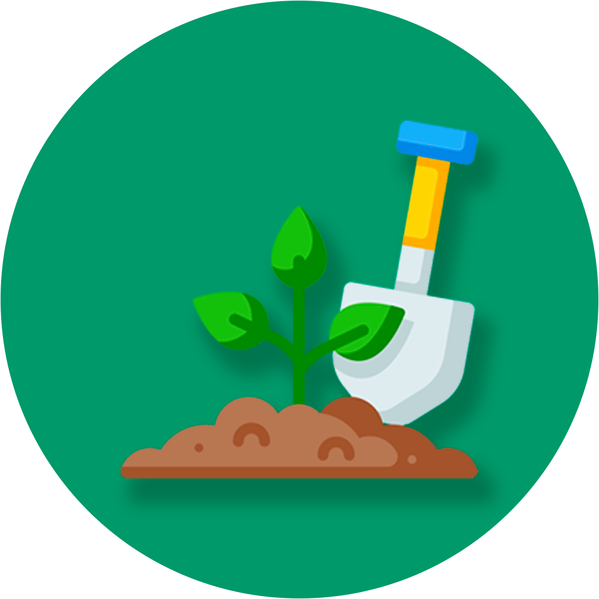

<h1 align="center">
  
</h1>

## 💻 Projeto
Nosso aplicativo Horta em casa ajuda você com diversas informações sobre hortaliças, legumes e frutas. Mostrando a melhor época para o plantio na sua região, suas vitaminas e muitos mais.

## :hammer_and_wrench: Recursos

-   [ ] Acompanhamento dos seus cultivos;
-   [ ] Melhores época para plantio;
-   [ ] A melhor forma para plantar seu cultivo;
-   [ ] Variedades: Frutífera, Legumes e Hortaliças;
-   [ ] Informações sobre as vitaminas do cultivos.

## ✨ Tecnologias

-   [ ] React Native
-   [ ] Javascript
-   [ ] Expo
-   [ ] Async Storage
-   [ ] Firebase
-   [ ] Vector Icons
-   [ ] Expo Notifications
-   [ ] Linear Gradient
-   [ ] Expo Google Fonts
-   [ ] React Navigation Stack
-   [ ] React Navigation Drawer

## ✨ Prototipagem inicial
Feito no [Figma](https://www.figma.com/) ----- [ Acessar - Horta em casa ](https://www.figma.com/file/m1X7MN8RNu4CQBcdqq303l/App?node-id=0%3A1).

## 📥 Download

No momento o aplicativo está disponível na [Google Play](https://play.google.com/store/apps/details?id=com.isaiasTortorele.Hortaemcasa).

 

  <small>Desenvolvido por Isaias Tortorele - Julho/2021</small>

   
   

